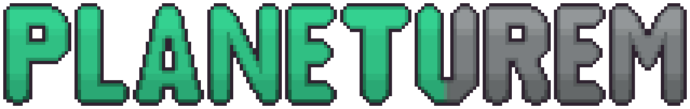
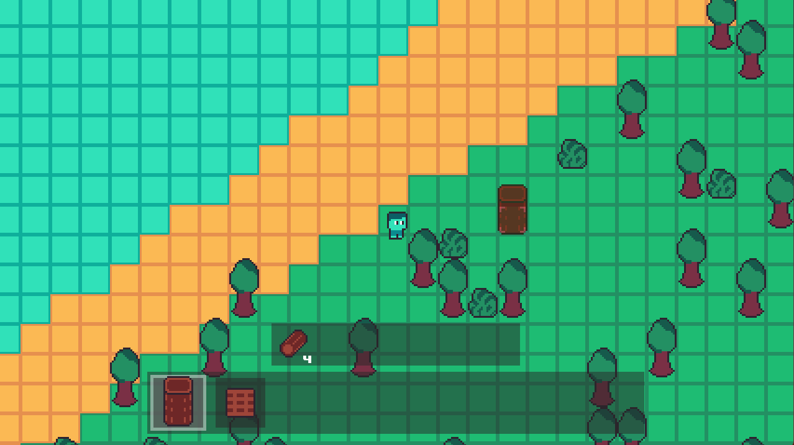

 

**Planeturem is a procedurally generated building/crafting game I wrote in C++ from scratch on top of SDL2 and OpenGL during a gap year, allowing the player to travel between planets and non-planet locations, alone or with friends online. It is on [Steam](https://store.steampowered.com/app/3323260/Planeturem/), featuring full online multiplayer with Steam integration.**

 

### Features
 - Procedurally generated planets
 - Data-driven design for game data (game items, objects, entities, planet generation parameters, etc)
 - Non-planet locations ("rooms"), which can be entered via "structures" on planets, or travelled to via rocket
 - Dynamic lighting
 - Fully custom inventory UI
 - Online multiplayer using the SteamNetworkingMessages API
 - Full controller support

 

## Brief history
When I first started working on Planeturem in July 2024, I initially chose to use Godot, as I knew it would help me accomplish realising my ideas faster.

After working with Godot for a couple of days and putting together a very simple prototype, despite being able to work on features fast, I was not a massive fan of searching through the plethora of options in the GUI to get what I needed, and even more so disliked working with GDScript (Godot's scripting language). This is mainly due to the dynamic typing; optional static typing is supported, but as of July 2024, some types could not be expressed such as typed dictionaries, which was frustrating and felt incomplete.

I decided to not use Godot for this project after completing this prototype, which is probably more of a testament to my lack of patience with drifting from a code-first approach rather than Godot itself.

I had just finished my [A-Level CS NEA project](https://github.com/jamiebrn/CS-NEA-orbital-prospector) a few months prior, which I wrote in C++ using SFML for rendering, input, etc. I knew I wanted to use C++ for Planeturem ("spacebuild" at this point), so I decided to use SFML as I was already familiar with it, which allowed me to put a prototype together quickly. After a day or 2 of work I got this simple prototype together.

While the essence of the game can be seen here, I would be confident in saying that none of the code from this prototype has survived architectural changes.

From here, I kept adding features, fixing bugs, normal software development stuff that will be covered in more detail in other sections.

However, something that should be known is that in April 2025 I decided to switch to SDL2 with OpenGL from SFML. This was due to SFML using a legacy version of OpenGL (1.3), which restricted use of modern graphics debugging tools such as RenderDoc, alongside the fact that I already had SDL implemented in the codebase (since January 2025) for input management, as SFML's controller support was severely lacking compared to SDL's.

For this switch, I wrote a [creatively named small generic 2D framework](https://github.com/jamiebrn/planeturem-framework) over SDL2 and OpenGL that had a very similar API to SFML, while allowing use of modern OpenGL versions and raw OpenGL calls if required. The similarity to SFML was an intentional design choice to make the switch as painless as possible (which was still rather painful), as the codebase was obviously at this point heavily coupled with the SFML API.

 

## Systems
This section contains write-ups of some major systems in the game's codebase. These are not entirely comprehensive, but rather just give a brief overview of the workings of each system at a high level.
 - [Chunk/ChunkManager](docs/chunk.md)
 - [Game Data](docs/game-data.md)
 - [Lighting](docs/lighting.md)
 - [Networking/Multiplayer](docs/networking.md)
 - [Immediate Mode GUI](docs/immediate-gui.md)
 - [Game Saves](docs/game-saves.md)
