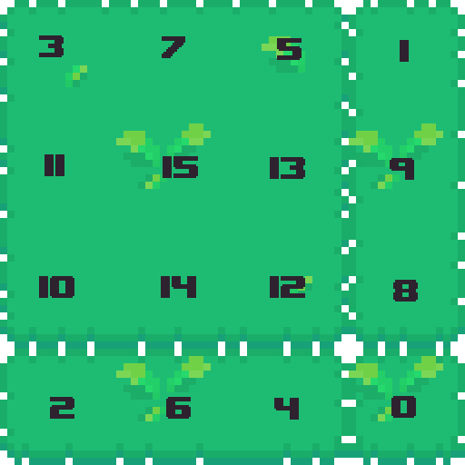
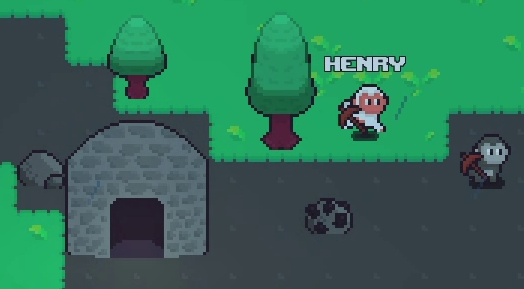
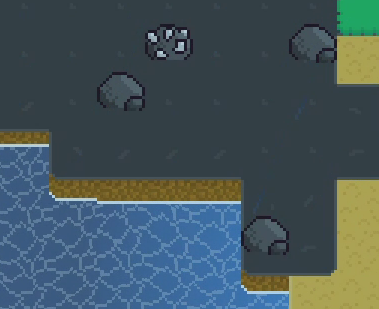

## Chunk

The Chunk class represents an 8x8 tile square chunk of world data. This consitutes of tiles, objects, structures, and entities. Each chunk is managed by the [ChunkManager](##ChunkManager) class; chunks are never created outside of the ChunkManager and all interaction should be done through the ChunkManager to ensure world consistency.

The world is generated using a combination of noise and seeded PRNGs. The noise generated is 2D and seamless, meaning it can be used to create a "planet" effect, i.e. the player can walk in one direction and end up in the same location.

I will somewhat briefly go over how each part of the world is generated.

### Tile Generation

Tiles are the ground of the world. They consist of different biomes and tilesets. Three noise values are layered in order to determine whether a tile exists in a certain position. These three noise values are the height noise, biome noise, and river noise. Biome noise determines what biome the tile is in, with the height noise determining which tile is present depending on the biome, if any at all. The river noise overrides all of this, and essentially cuts out "rivers" into the tiles.

The pseudocode algorithm might look something like this:
```cpp
riverNoiseValue = sampleRiverNoise(x, y);

// "Cut out" of world tiles
if riverNoiseValue >= riverNoiseMin and riverNoiseValue <= riverNoiseMax
    return null

biomeNoiseValue = sampleBiomeNoise(x, y);
biomeGenData = getBiomeGenerationData(biomeNoiseValue);

heightNoiseValue = sampleHeightNoise(x, y);

// Get tile data for height noise value using biome data
tileData = getTileData(biomeGenData, heightNoiseValue);

return tileData
```

#### TileMaps
The tile generation would have no visual output without the TileMap system. It allows for autotiling of tilemaps in the world and drawing of computed tilemaps.

Each tile in the TileMap is represented by a byte, with these bytes being stored in an array of size chunk size * chunk size (one byte per tile).

Each byte has the following layout, with bit 7 being the most significant:
 - bit 7: whether tile is present
 - bit 4-6: tilemap variation (3 bits, allows for each tilemap to have 2^3 (8) variations)
 - bit 3: whether adjacent tile upward is present
 - bit 2: whether adjacent tile to the left is present
 - bit 1: whether adjacent tile to the right is present
 - bit 0: whether adjacent tile downward is present

Using the adjacent value bits 0-3, we have 2^4 (16) combinations, each corresponding to a different tile in the tilemap, representing different connecting tiles.



These values can each be used when building the vertices of the tilemap to send to the GPU.

Caching adjacent tile values like this means we only need to modify the tile we are actually modifying and the 4 adjacent tiles, rather than recomputing each tile's adjacent tiles every time the tilemap is updated.

#### TileMap placement
When tiles are placed in the world, the respective TileMap is updated for that particular chunk, as well as the adjacent chunks' TileMap with the same type being recalculated. This allows for seamless TileMaps across chunks, taking into consideration adjacent TileMaps.

Tiles take draw order depending on their ID/TileMap type - lower IDs are drawn before i.e. below tiles with higher IDs. This is important as in many cases TileMaps need to sit on top of each other.

For example, in this image, the stone tiles are also set underneath the grass tiles, and drawn underneath.



The `Chunk` class handles this automatically - when placing a tile, if any adjacent tiles have a higher ID, the current tile is also placed in that adjacent tile's location. This places it "underneath" as the tile being placed has a lower ID, so will be drawn underneath. This checking and placing of adjacent tiles of course means that a tile being placed on the edge of a chunk may cause new tiles to be placed in the adjacent chunk. This in turn means that chunks adjacent to that adjacent chunk need to have their TileMaps updated for that tile ID, as the new tile may affect these chunk's adjacent tile values.

When generating chunks, TileMap vertex data calculation is also deferred until the chunk has finished generating. This is to avoid redundant TileMap vertex recalculations while placing the generated tiles in the chunk. TileMap variations (i.e. bits 4-6) are entirely random and non-deterministic, as they are only visual and have no effect on gameplay.

#### Cliffs
Cliffs are a visual feature that prevents the world from looking like a floating block of land above water. Each chunk can contain a cliff at each tile position of 4 different types (straight, left curve, right curve, left and right curve).

When any tiles are updated, the cliffs for the modified chunk and adjacent chunks are recalculated. Adjacent chunk cliffs need to be recalculated as a tile on a chunk boundary can affect the cliff tiles for adjacent chunks, e.g. if a tile is placed at the bottom of a chunk, then a cliff will need to be created at the top of the chunk underneath.



### Object Generation
Objects spawn naturally in the world and can be interacted with by the player, e.g. destroyed for resources. They can also be placed from the player's inventory.

Object spawning in chunks is controlled via the use of a seeded PRNG. The initial seed is computed as follows:
```cpp
unsigned int seed = (chunkManager.getSeed() + planetType) ^ chunkPosition.hash();
```
Where the `ChunkPosition` hash is a unique hash of the chunk position's X and Y coordinate, which ensures each chunk has a unique set of object spawns.

Each tile in the chunk is then iterated over, using the PRNG to generate a float in the range 0-1. Biome generation data is retrieved for each tile, which contains a list of objects with spawn probabilities. The code looks something like this:
```cpp
ObjectType getRandomObjectToSpawnAtWorldTile(int x, int y, RandInt& randGen)
{
    biomeGenData = getBiomeGenerationData(x, y, biomeNoise);

    if not getObjectsCanSpawnAtTile(x, y)
        return -1;

    cumulativeChance = 0;
    randomSpawn = randGen.generate(0, 1);

    // Iterate over all potential object spawns and get object data using probability generated
    for objectGenData in biomeGenData
    {
        cumulativeChance += objectGenData.spawnChance;

        if (randomSpawn <= cumulativeChance)
            return objectGenData.object;
    }

    return -1;
}
```
This system, while simple, ensures object spawns are the same at a specific tile with a given world seed.

Resources can also regenerate after a set amount of time, determined by the resource regeneration time range for the chunk's respective biome data. This regeneration is non-deterministic, meaning after the initial resources have generated in the world, any future regenerations will not depend on the world seed.

### Structure Generation
Structures are naturally generated monuments in the world, enterable by players.


Structure generation uses the PRNG used for object generation, to ensure structure generation is also deterministic. The pseudocode algorithm would look like this:
```cpp
if chunk contains water
    return;

structureType = getStructureGenerationType(chunk, randGen);

// No structure (chunk can have no structure)
if not structureType
    return;

// Generate structure spawn tile, ensuring the structure stays within chunk bounds
structureTileX = randGen.generate(0, CHUNK_TILE_SIZE - structureSizeX);
structureTileY = randGen.generate(0, CHUNK_TILE_SIZE - structureSizeY);

// Create dummy/blank objects in spaces where structure occupies, for collision etc.
// Tiles are selected to have collision etc based on a bitmask loaded from the structure data (loaded from game data at runtime)
setChunkStructureObjects(chunk);
```

### Entity Generation
Entities represent living parts of the world, such as animals. They have set AI behaviours, with data such as textures, AI type and AI parameters being selected by game data loaded at runtime. AI behaviour types are written into the executable.

Entity generation is non-deterministic, as I did not feel this was something I wanted to remain across seeds. Entities also regenerate after a set period of time, so deterministic spawning would mean that each respawn of entities would be the same, which is not ideal. A "respawn counter" could be kept to increment when a respawn occurs to offset the PRNG seed to keep determinism, but then this would need to be stored for each chunk in the game's save file as it would need to remain across sessions. While this would probably just be a byte or 2 per chunk, I still see it as a waste of resources when I do not deem deterministic entity generation to improve the game at all, and probably would not be noticed. Whereas deterministic object and tile generation is more important as they actually build the world around the player so should be consistent across seeds, entities are moving and are not part of "the world" per se.

Entity type spawn selection for each tile is performed in the exact same way as [object generation](#L97).

## ChunkManager

The ChunkManager system manages chunks in the game world, loading and unloading them as required. It provides an API to interact with the game world, such as placing and destroying objects, getting objects or entities at specified positions, testing collisions, etc.

This system isn't particularly interesting, as it essentially just calls respective functions on the correct chunk, and manages chunk lifetimes. I will mention a few systems that I feel are more interesting.

### Chunk loading
Chunk loading is carried out in the `updateChunks()` function. This uses the [ChunkViewRange](##ChunkViewRange) struct for each client in order to load any chunks in the player view area that have not been loaded.

There is a logical division between chunks - loaded chunks are currently being updated and in the player's view, while stored chunks are chunks that have been previously generated/loaded from a save file and are currently not active.

`loadedChunks` and `storedChunks` are both hashmaps using a `ChunkPosition` as the key, which is a struct containing an X and Y position corresponding to the chunk's world position. This struct contains a hashing implementation which enables it's use in hashmaps. The value corresponding to a key is a pointer to a chunk, or to be exact is of type `std::unique_ptr<Chunk>`.

The `updateChunks()` function essentially carries out these instructions:
```cpp

bool updateChunks()
{
    bool hasModifiedChunks = false;
    for chunkPosition in chunkViewRanges
    {
        if chunkPosition in loaded
            continue;

        hasModifiedChunks = true;

        if chunkPosition in stored
        {
            move stored chunk into loaded
            continue;
        }

        // Chunk needs to be loaded but is not in stored chunks
        generateChunk();
    }

    return hasModifiedChunks;
}

```

Unloading chunks is essentially the reverse of this.

### Finding spawn locations

The function ```findValidSpawnChunk()``` can be used to find a chunk valid for the player to spawn on. It works as follows:

```cpp
ChunkPosition findValidSpawnChunk(int waterlessAreaSize)
{
    // Calculate search area size to increment by each failed search
    int searchIncrement = 1 + waterlessAreaSize * 2;
    while searching
    {
        bool validSpawn = true;
        for chunkPosition in searchArea
        {
            Chunk chunk = generateChunkMinimal();

            // If chunk doesn't contain water, chunk is valid. Continue to next chunk
            if (!chunk.getContainsWater())
                continue;

            // Chunk contains water, search area is not valid. Go to next search area
            validSpawn = false;
            break;
        }

        if (validSpawn)
        {
            return searchArea centre chunk;
        }

        // Not valid spawn, increment
        searchArea += searchIncrement;
    }

    // Searching ended without finding chunk - recursively call with search with less strict parameters
    if (waterlessAreaSize > 0)
        return findValidSpawnChunk(waterlessAreaSize - 1);

    // Default fail case
    return ChunkPosition(0, 0);
}
```

### Chunk and Tile from Offset
I often found the need to find a Chunk/Tile pair in the world from an offset from another Chunk/Tile pair. This allowed for "relative" searching throughout the world. While it may seem simple I found myself spending a bit too long on this function, so thought I would include it here.

With `CHUNK_TILE_SIZE` being the width and height of a square chunk in tiles, the function works as follows:

```cpp
pair<ChunkPosition, Vector2i> getChunkTileFromOffset(ChunkPosition chunk, Vector2i tile, int xOffset, int yOffset, int worldSize)
{
    // Add offset to tile
    tile.x += xOffset;
    tile.y += yOffset;

    // Perform wrapping of tile and offset chunk value if not in chunk range
    if (tile.x < 0 || tile.x >= CHUNK_TILE_SIZE || tile.y < 0 || tile.y >= CHUNK_TILE_SIZE)
    {
        // Modify chunk values depending on tile value after being offset
        if (tile.x < 0)
            chunk.x -= ceil(abs(tile.x) / CHUNK_TILE_SIZE);
        else if (tile.x >= CHUNK_TILE_SIZE)
            chunk.x += ceil(1 + tile.x) / CHUNK_TILE_SIZE - 1;

        if (tile.y < 0)
            chunk.y -= ceil(abs(tile.y) / CHUNK_TILE_SIZE);
        else if (tile.y >= CHUNK_TILE_SIZE)
            chunk.y += ceil(1 + tile.y) / CHUNK_TILE_SIZE - 1;

        // Wrap tile to chunk range after shifting chunk position
        tile.x = (tile.x % CHUNK_TILE_SIZE + CHUNK_TILE_SIZE) % CHUNK_TILE_SIZE;
        tile.y = (tile.y % CHUNK_TILE_SIZE + CHUNK_TILE_SIZE) % CHUNK_TILE_SIZE;

        // Wrap chunk tile (may be out of world bounds)
        chunk.x = (chunk.x % worldSize + worldSize) % worldSize;
        chunk.y = (chunk.y % worldSize + worldSize) % worldSize;
    }

    return {chunk, tile};
}
```

### Nearby Crafting Stations
As this is a crafting game, and I wanted to limit player recipes/progression through crafting stations, I needed a function that would return the crafting stations that the player was in range of. Crafting stations types are represented as strings for the base type and an integer for the level. This allows higher levels to craft lower level recipes. For example, a "bench" level 1 can craft bench level 1 recipes, and a "bench" level 2 can craft bench level 1 and level 2 recipes. Crafting station types are represented as strings as they are loaded in at runtime; it is data-driven - meaning the game cannot predict what crafting stations may appear. This allows for easy addition of content without recompilation, which is great for iterative development and allows for player-created content.

To search which crafting stations the player is in range of, I wrote this function:
```cpp
unordered_map<string, int> getNearbyCraftingStationLevels(ChunkPosition playerChunk, Vector2i playerTile, int searchArea)
{
    unordered_map<string, int> craftingStationLevels;

    for offset in searchArea range
    {
        // Get chunk and tile from offset
        pair<ChunkPosition, Vector2i> chunkTile = getChunkTileFromOffset(playerChunk, playerTile, offset.x, offset.y, worldSize);

        // If chunk not loaded, do not get object
        if chunkTile.first not in loadedChunks
            continue;
        
        BuildableObject* object = getChunkObject(chunkTile.first, chunkTile.second);

        // If no object, do not get data
        if (!object)
            continue;

        // Get object type
        ObjectType objectType = object->getObjectType();
        if (objectType < 0)
            continue;

        // Get object data
        const ObjectData& objectData = ObjectDataLoader::getObjectData(objectType);

        // If not a crafting station, do not add to hashmap
        if (objectData.craftingStation.empty())
            continue;

        // Add crafting station to map
        if (craftingStationLevels.count(objectData.craftingStation) > 0)
        {
            // Crafting station level exists, set level to highest level present
            craftingStationLevels[objectData.craftingStation] = max(objectData.craftingStationLevel, craftingStationLevels[objectData.craftingStation]);
        }
        else
        {
            craftingStationLevels[objectData.craftingStation] = objectData.craftingStationLevel;
        }
    }

    return craftingStationLevels;
}
```

## ChunkViewRange
The `ChunkViewRange` class represents a rectangular chunk area, used to represent an area of the world visible to a player. It allows creation of a hashset of key type `ChunkPosition` containing all chunks in the visible area, as well as creating a hashset from a vector of `ChunkViewRange`. This is particularly useful in multiplayer where all chunks visible to players need to be updated, but chunks in the intersection of multiple player's view areas should not be updated multiple times obviously. A hashset of all visible chunks ensures each `ChunkPosition` visible occurs only once.

The functionality of this class was previously built directly into the `ChunkManager` class functions. However, during the addition of multiplayer I felt the need to have a clean abstraction over a visible chunk area, as well as handling iteration over this range and handling of world wrapping at planet edges. This was because each player would have their own visible area in the world, which would be processed on the host system in multiplayer, so encapsulating this system only made sense.
