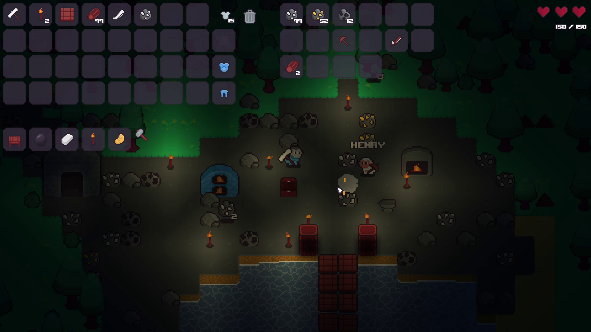

## Lighting
Lighting in Planeturem is dynamic. It is based on a very simple grid-based breadth-first search system.



A demonstration of this lighting system before being implemented into the game can be seen [here](https://www.youtube.com/watch?v=wPAsHkzk4gM).

### Implementation
The light propagation uses a simple breadth-first search across the world. The lighting simulation runs in local space, where the memory allocated for lighting propagation calculations represents the currently active chunk area.

The world tiles are divided each into a 2x2 grid. Each active chunk is iterated over each lighting recalculation, with each object with light emission being added to the lighting engine's `lightSources` float vector. Objects with the light absorption property are put into the `obstacles` float vector.

Calculation is then done by iterating over the `lightSources` vector, adding any indexes with light sources to a queue. This queue is then iterated over, propagating the current light to the 4 adjacent tiles with a decreased lighting value. If there is an obstacle at any of these positions, that lighting value will be dampened to simulate absorption of light. If the current lighting value is equal or larger, then the light is not propagated (this avoids infinite processing loops i.e. light propagating back into its own source). Propagated tiles are then added to the end of the queue to be processed later.

The code looks something like this:
```cpp
void calculateLighting()
{
    queue lightQueue;

    // Add light sources to queue
    for lightSource in lightSources
    {
        lightQueue.push_back(lightSource);
    }

    while not lightQueue.empty()
    {
        lightSource = lightQueue.front();

        // Propagate to adjacent tiles
        propagateLightUp(lightSource);
        propagateLightDown(lightSource);
        propagateLightLeft(lightSource);
        propagateLightRight(lightSource);

        // Erase light source as has been processed
        lightQueue.pop();
    }
}
```

### Rendering
The calculated `lighting` float vector is uploaded to the GPU directly as a texture, with each float value being interpreted as the red channel.
